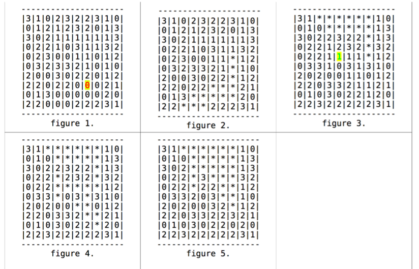

# Artificial-Intelligence
# Classic Algorithms in Artificial Intelligence

## Project 1:

### Introduction:

The problem is a variant of 8-Queens which is a typical case of the search problem. This project implements three classic algorithms: Breadth First Search(BFS), Depth First Search(DFS) and Simulated Annealing(SA) to give a solution of the problem.

### Description of the problem: 

you are a keeper of a lizard zoo, and you are given the number of lizards and a zoo board. Your job is to keep every lizard can't be attacked by another lizard via vertical, horizental or diagonal direction. The board also contains some trees, which can be viewed as a barrier or wall and block lizard's attack in this direction.

### Input: 
1. Method Name (BFS, DFS or SA)
2. Side of the square zoo. (positive 32-bit integer)
3. Number of lizards. (positive 32-bit integer)
4. The n x n board. (it will have a 0 where there is nothing, and a 2 where there is a tree)

### Output:
1. OK or FAIL, indicating whether a solution was found or not.
2. The n x n board. It will have a 0 where there is nothing, a 1 where you placed a baby lizard, and a 2 where there is a tree.

### Sample:
SA  
8  
9  
00000000  
00000000  
00000000  
00002000  
00000000  
00000200  
00000000  
00000000  

one possible correct output.txt is:  
OK  
00000100  
10000000  
00001000  
01002001  
00001000  
00100200  
00000010  
00010000  

## Project 2:
### Introduction:
Game play is a important topic in AI. For many ordered games which means the next state depends on the current state, AI can utilize efficient algorithm to predict further steps(states) based on the current one, and then it can get a smarter move via its "prediction". Mini-max algorithm with alpha-beta pruning is one of the algorithms that can be used into this game playing. This project implements Mini-max algorithm for the game *The Fruit Rage!* 

### Description:
At the beginning of each game, all cells are filled with fruits. Players play in turn and can pick a cell of the box in their own turn and claim all fruit of the same type, in all cells that are connected to the selected cell through horizontal and vertical paths. For each selection or move the agent is rewarded a numeric value which is the square of the number of fruits claimed in that move. Once an agent picks the fruits from the cells, their empty place will be filled with other fruits on top of them (which fall down due to gravity), if any. In this game, no fruit is added during game play. Hence, players play until all fruits have been claimed.

#### Example:

### Input:
1. Integer n, the width and height of the square board (0 < n <= 26)
2. Integer p, the number of fruit types (0 < p <= 9)
3. Strictly positive floating point number, your remaining time in seconds
4. The n x n board. Each character can be either a digit from 0 to p-1, or a * to denote an empty cell

### Output:
1. Your selected move, represented as two characters:
A letter from A to Z representing the column number (where A is the leftmost column, B is the next one to the right, etc), and
A number from 1 to 26 representing the row number (where 1 is the top row, 2 is the row below it, etc).
2. the n x n board just after your move and after gravity has been applied to make any fruits fall into holes created by your move taking away some fruits

### Sample:
2  
3  
123.6   
01  
21  
one possible correct output.txt is:  
B1  
0*  
2* 
